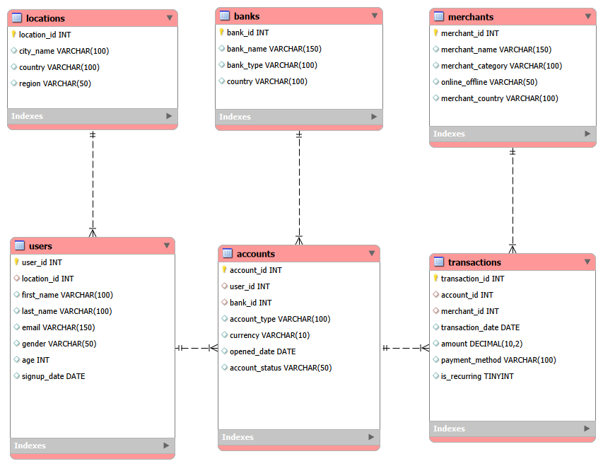
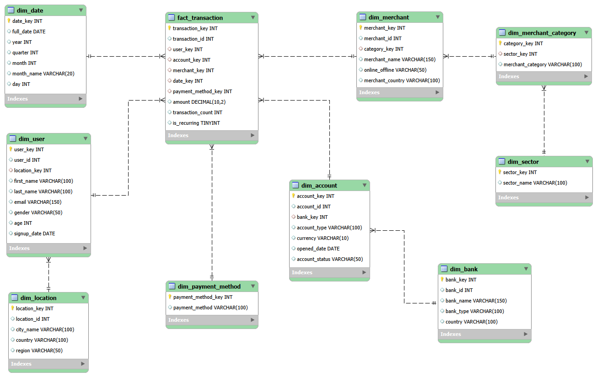
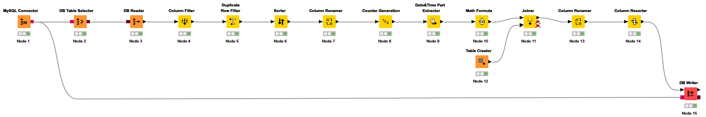
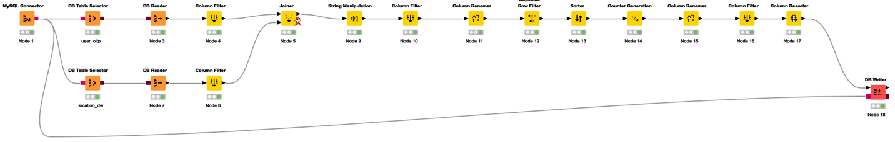
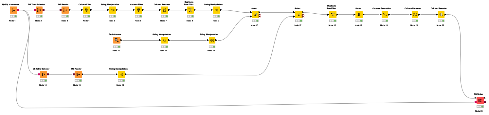
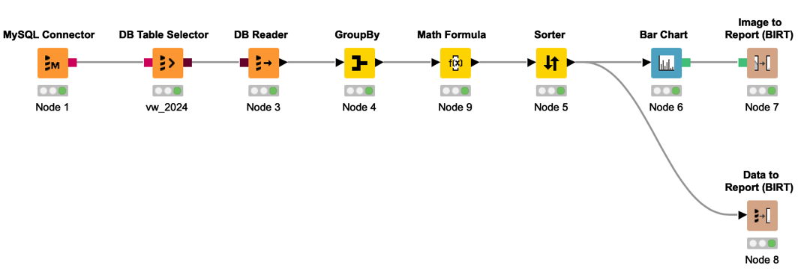
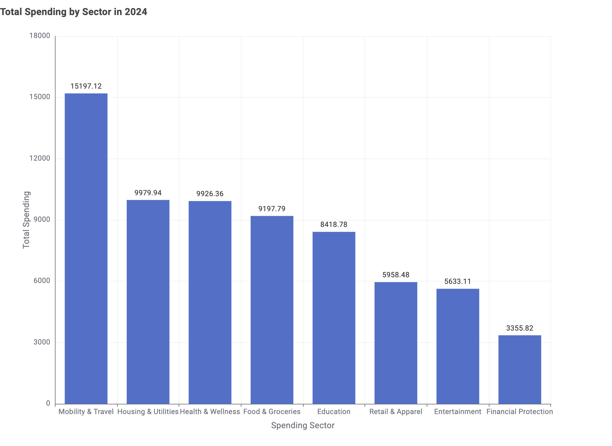

# Digital Banking BI & Data Warehouse

An end-to-end business intelligence project that transforms synthetic digital-banking transaction data from an operational relational model into an analytics-ready snowflake warehouse. The project combines **MySQL data modelling, dimensional modelling, KNIME ETL workflows, SQL views, and BI reporting** to analyse personal-finance and spending behaviour.

## Project goal

Operational banking data is well suited to recording individual transactions, but repeated analytical questions require many joins across users, accounts, merchants, banks and locations. This project builds a separate data warehouse to support reusable analysis of:

- spending by month and merchant sector
- transaction volume by bank and payment method
- recurring vs one-time expenditure
- regional and customer-level spending patterns
- category and sector reporting

The source data is **synthetic** and was generated for the project; it does not contain real customer data.

## Architecture

### 1. OLTP source model

The operational schema stores users, accounts, banks, merchants, locations and transactions in a normalised relational structure.



### 2. Snowflake data warehouse

The analytical model is centred on `fact_transaction`, with dimensions for date, user, account, merchant and payment method. Several dimensions are further normalised into sub-dimensions, including location, bank, merchant category and sector.



**Fact grain:** one row per transaction.

**Primary measures:** transaction amount, transaction count, and recurring-spend indicator.

## ETL in KNIME

The ETL layer moves data from the MySQL OLTP schema into the warehouse. Representative workflows perform source extraction, cleaning, lookup joins, surrogate-key generation, dimensional transformations and database writes.

### Date dimension

The date workflow deduplicates transaction dates, creates a surrogate `date_key`, derives calendar attributes and writes the result to `dim_date`.



### User dimension

The user workflow joins OLTP user records to the warehouse location dimension, cleans fields, generates `user_key`, and loads `dim_user`.



### Merchant category dimension

Merchant categories are cleaned and mapped to broader business sectors before receiving warehouse surrogate keys.



The executable KNIME workflows are available in [`workflows/`](workflows/).

## SQL analytics

The project includes a MySQL view for monthly spending by sector in 2024. It joins the fact table to date, merchant, merchant-category and sector dimensions, then aggregates:

- total transactions
- total spending
- average transaction amount

See [`sql/vw_2024_monthly_sector_spending.sql`](sql/vw_2024_monthly_sector_spending.sql).

## BI reporting

A KNIME reporting workflow groups the SQL-view output by spending sector, calculates annual totals and average transaction value, sorts sectors by total spend, and produces a bar-chart report.





### Key insight

**Mobility & Travel recorded the highest total spending in 2024**, followed by Housing & Utilities, Health & Wellness, and Food & Groceries. Financial Protection had the lowest total spending among the displayed sectors.

## Repository structure

```text
digital-banking-bi-warehouse/
├── README.md
├── assets/
│   ├── oltp_schema.png
│   ├── snowflake_dw_schema.png
│   ├── etl_dim_date.png
│   ├── etl_dim_user.png
│   ├── etl_dim_merchant_category.png
│   ├── bi_reporting_workflow.png
│   └── spending_by_sector_2024.png
├── data/
│   ├── accounts.csv
│   ├── banks.csv
│   ├── locations.csv
│   ├── merchants.csv
│   ├── transactions.csv
│   └── users.csv
├── docs/
│   └── data_dictionary.md
├── models/
│   ├── finance_oltp.mwb
│   └── finance_dw.mwb
├── workflows/
│   ├── 01_dim_date.knwf
│   ├── 03_dim_user.knwf
│   ├── 07_dim_merchant_category.knwf
│   └── report_spending_by_sector.knwf
├── sql/
│   └── vw_2024_monthly_spending.sql
├── report/
│   └── technical_report.pdf
└── .gitignore
```

## How to reproduce

1. Open `models/finance_oltp.mwb` in MySQL Workbench and forward-engineer the OLTP schema.
2. Import the CSV files from `data/` into the OLTP tables in foreign-key dependency order.
3. Open `models/finance_dw.mwb` and forward-engineer the warehouse schema.
4. Import the `.knwf` files from `workflows/` into KNIME Analytics Platform.
5. Update the MySQL connection configuration in KNIME for your local environment.
6. Execute the dimension/fact-loading workflows.
7. Run `sql/vw_2024_monthly_sector_spending.sql` in MySQL.
8. Execute `workflows/report_spending_by_sector.knwf` to reproduce the spending report.

Database passwords and local connection credentials are intentionally not included.

## Tech stack

**MySQL · MySQL Workbench · SQL · KNIME Analytics Platform · ETL · Data Warehousing · Dimensional Modelling · Business Intelligence Reporting**

## What this project demonstrates

- relational OLTP database modelling
- fact/dimension and snowflake schema design
- ETL workflow construction in KNIME
- surrogate-key and lookup logic
- SQL aggregation views
- end-to-end BI reporting from operational data to business insight
- reproducible project organisation and technical documentation
